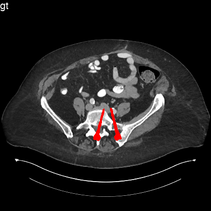
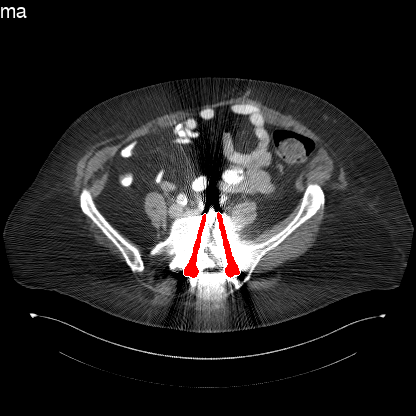

This repo is used to prepare metal artifact dataset in [DuDoNet](https://openaccess.thecvf.com/content_CVPR_2019/html/Lin_DuDoNet_Dual_Domain_Network_for_CT_Metal_Artifact_Reduction_CVPR_2019_paper.html) and [DuDoNet++](https://link.springer.com/chapter/10.1007/978-3-030-59713-9_15). The clean and metal contaminated CT images are illustrated below, respectively. Note the red pixels indicate the metallic implants.

 
 

1. Create folders `database_MAR/images_train` and `database_MAR/images_val`.

2. We put a sample image `images/000001_01_01` to run the dome `prepare_image_database.m`.

3. To simulate the whole MAR database. Download CT images according to step 3. Uncomment `line 120` and comment `ling 121` in `prepare_image_database.m`. Mode `train\val` can be selected in `line 32`. Note: `mode = 'train'` will take more than 5 hours and require ~560 G hard disk storage.

4.  Download and unzip [DeepLesion dataset](https://nihcc.app.box.com/v/DeepLesion) to folder `images`. Images_png_01.zip~Images_png_10.zip is sufficient. The structure of the unzipped files should look like:
    ```
    images/
        000001_01_01/
        000001_02_01/
        ...
    ```


